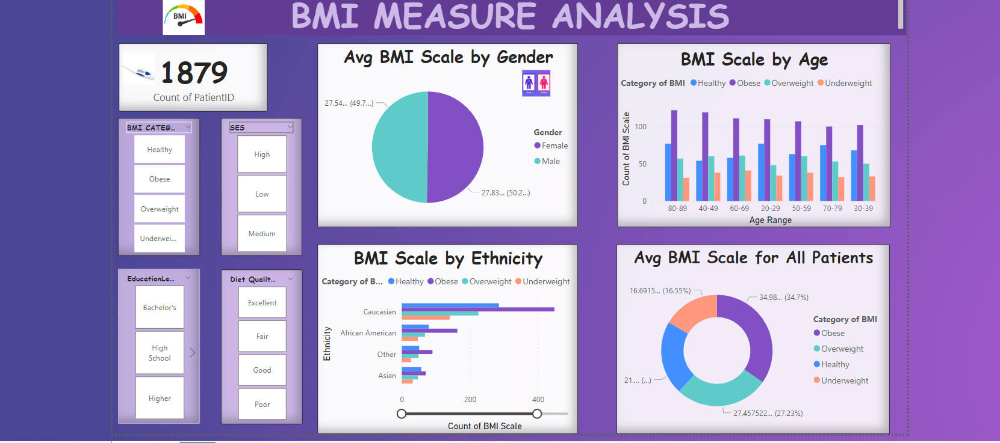

# PORFOLIO- SQL TO POWER BI

## Exploring BMI Categories and Health Factors: A Data Analysis Project

# Table of contents 

- [Objective](#objective)
- [User story](#Userstory)
- [Data Source](#data-source)
- [Stages](#stages)
- [Design](#design)
  - [Tools](#tools)
- [Development](#development)
  - [Pseudocode](#pseudocode)
  - [Data Exploration](#data-exploration)
  - [Data Cleaning](#data-cleaning)
   - [Testing](#testing)
  - [Data Quality Tests](#data-quality-tests)
- [Visualization](#visualization)
  - [Results](#results)
  - [DAX Measures](#dax-measures)
- [Analysis](#analysis)
  - [Findings](#findings)
   - [Discovery](#discovery)
- [Recommendations](#recommendations)
  - [Conclusion](#conclusion)
  - [Project Evaluation](#project-evaluation)

# Objective

Objective of Project
Exploring the correlation between BMI and variables like age, socioeconomic status, diet, and education to identify populations at risk of hypertension and diabetes.
Key Pain Point

Understanding how BMI correlates with various factors to pinpoint vulnerable populations and inform targeted health interventions.

## User Story
I aimed to design a dashboard providing instant analytics on BMI, age, socioeconomic status, education, and diet to identify and support populations at risk of hypertension and diabetes.

The Dashboarrd will provide insights about the potential triggers of diabetes with people of a high BMI measure
  - BMI and Age
  - BMI and Socio-Economic Factors
  - BMI Against Education
  - BMI Against Diet
  - BMI Against Gender
  - BMI Against Ethnicity

# Data Source

This dataset contains comprehensive health data for 1,879 patients, including critical information such as Patient ID, Demographic Details, and Lifestyle Factors,it offers insights into factors impacting the prevalence of diabetes.[The data is sourced from Kaggle: ](https://www.kaggle.com/datasets/rabieelkharoua/diabetes-health-dataset-analysis)

# Stages

- Design
- Developement
- Testing
- Analysis 

# Design 

## Dashboard components required 
- What should the dashboard contain based on the requirements provided?

The dashbord should answer the following question

1. Which age group has the highest BMI Measure?
2. Does Ethicinity have a factor on BMI Measure?
3. Which educational level has the worst BMI?
4. What is the Average BMI across the Population in Question?
5. Is Gender a factor interms of Average BMI?
6. To what Extent is Diet a Factor to Average BMI?

## Tools Used

    Excel: Data exploration
    SQL Server: Data cleaning, testing, and analysis
    Power BI: Data visualization through interactive dashboards
    GitHub: Hosting project documentation

# Development

## Pseudocode

- General Approach

1. Get the data
2. Explore the data in Excel
3. Load the data into SQL Server
4. Clean the data with SQL
5. Test the data with SQL
6. Visualize the data in Power BI
7. Generate the findings based on the insights
9. Publish the data to GitHub Pages

   

## Data Exploration

This is the stage where you have a scan of what's in the data, errors and inconcsistencies.

- Initial Observations:
  1. The dataset is voluminous; focused on relevant data matching project objectives.
  2. Identified inconsistencies in decimal places, standardized across relevant columns.
  3. Categorised all data that was represented by Binary coding .

## Data Cleaning

  -  Column and Row Checks:
  1. Ensured data integrity through column count,
  2. row count
  3. duplication checks.
  4. Verified data types for accuracy.
  5.  Cheched for Null and Blanks  

    Working Dataset:
    
    Reduced columns from 46 to 10, focusing on key variables.
       
    Standardized BMI, diet quality, and activity to 4 decimal places for consistency.

       

## Data Testing

Below are the Data Quality Check

## Row count

  

## Data Type Check

  

## Duplicate Check

  

   # Visualization  
   

-  
   
  
This shows the different factors that affect BMI measures and to what extent.

## DAX Measures

### AVERAGE BMI CATEGORIS

  

Return Average BMI of All Patients

### SOCIAL ECONOMIC STATUS

  

Return Socila Economic status againts average BMI

### EDUCATIONAL LEVEL

  

return Educational Level Against Average BMI

### DIET SCORES

  

 return Average Diet Score Against Average BMI  

# Data Analysis
   
  (i) Age and Avg BMI, showed a distribution across age groups to understand health demographics related to BMI categories.

  (ii) BMI and Socio-Economic Factors examined BMI distribution based on socioeconomic factors, identifying correlations and impacts on BMI outcomes.
    
  (iii) BMI Against Education Investigated BMI in relation to educational attainment to assess educational impacts on BMI and health.

   (iv) BMI Against Diet:Explored BMI categories in connection with diet quality and habits to understand dietary influences on BMI.
    
    (v) BMI and diet scores was used to determine the impact of diet on the sacle of BMI.
     

  ## Findings
  

   (i) BMI Age Analysis: Highlighted obesity trends across different age groups, emphasizing the need for age-specific health interventions.Age groups of 40-49 and 80-89               had the highest record of Obesity whilst this was common in all ages each group recording above 100 patients as being Obese.
    
  (ii) BMI Education Analysis: Identified higher obesity rates among certain education levels especialy holders of Barchelors Degree qualification.These constitute atleast             39% of the populations and have shown high numbers of those with average BMI above the recommended.
    
  (iii) BMI Socioeconomic Status Analysis: Noted variations in BMI across different socioeconomic groups and medium income earners being the highted numbers of Obese                   Patients recording 302.
    
  (iv) BMI Diet Score: People who's diet score was rated poor and fair had their Average BMI above avarage,Out of the population of 1,879, 321 diet score was poor and 245               was fair and also categorised Obese being 30% of the population.

   (V) BMI Etinicity: It was also noted the People of Causian race had average BMI above average and where of the population 280 Causians were recorded as Obese and                     Overweight.

   (Vi) BMI Gender: Gender is not a big issue when it comes to Average BMI measure.This was just a 1% difference between them and Women having a higher % than women.

  (Vii) It was also noted that out of the  entire population 34% was categorised as Obese and 27% was found Overweight, thereforebhaving over half of the population being               unhealhty and potential risk to the deadly diseases.
  
     
# Recommendations

   (i) BMI by Age: Develop targeted interventions for specific age groups to prevent obesity Especially eary intervention for the age of 20-29 so that they mature with the        culture of being and maintaing a healthy life style.
    
  (ii) BMI by Socioeconomic Status,Implement customized health programs for different SES groups.
    
  (iii) BMI by Education Level: Tailor public health campaigns to promote healthy lifestyles among different educational backgrounds.
    
   (iV) BMI by Diet Score: Encourage healthier eating habits through nutritional guidance and education.

# Conclusion

The BMI analysis project has provided valuable insights into the factors influencing obesity across different demographics. The findings underscore the importance of age, education, socioeconomic status, and diet in shaping BMI trends. By implementing targeted interventions and tailored health programs, we can address the specific needs of various groups and promote healthier lifestyles.

# Project Evaluation

This project was a worthwhile undertaking as it highlighted critical areas for intervention and provided actionable recommendations to combat obesity. The insights gained from this analysis can inform public health policies and programs, ultimately contributing to better health outcomes for diverse populations. The project's success lies in its ability to identify at-risk groups and propose practical solutions, making it a valuable contribution to public health research and practice.

