# SQL TO POWER BI.


---------------------------------------------------------------------------------------------------------------------------------

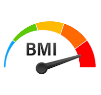 

## Body Mass Index  A numerical value of a person's weight in relation to their height. 

------------------------------------------------------------------------------------------------------------------------------------
# Table of contents 

- [Objective](#objective)
- [User story](#Userstory)
- [Data Source](#data-source)
- [Stages](#stages)
- [Design](#design)
  - [Tools](#tools)
- [Development](#development)
  - [Pseudocode](#pseudocode)
  - [Data Exploration](#data-exploration)
  - [Data Cleaning](#data-cleaning)
   - [Testing](#testing)
  - [Data Quality Tests](#data-quality-tests)
- [Visualization](#visualization)
  - [Results](#results)
  - [DAX Measures](#dax-measures)
- [Analysis](#analysis)
  - [Findings](#findings)
   - [Discovery](#discovery)
- [Recommendations](#recommendations)
  - [Conclusion](#conclusion)
  - [Project Evaluation](#project-evaluation)

# Objective


Objective of Project
Exploring the correlation between BMI and variables like age, socioeconomic status, diet, and education to identify populations at risk of hypertension and diabetes.
Key Pain Point

Understanding how BMI correlates with various factors to pinpoint vulnerable populations and inform targeted health interventions.


## User Story
I aimed to design a dashboard providing instant analytics on BMI, age, socioeconomic status, education, and diet to identify and support populations at risk of hypertension and diabetes.

The Dashboarrd will provide insights about the potential triggers of diabetes with people of a high BMI measure
  - BMI and Age
  - BMI and Socio-Economic Factors
  - BMI Against Education
  - BMI Against Diet
  - BMI Against Gender
  - BMI Against Ethnicity


# Data Source

This dataset contains comprehensive health data for 1,879 patients, including critical information such as Patient ID, Demographic Details, and Lifestyle Factors,it offers insights into factors impacting the prevalence of diabetes.[The data is sourced from Kaggle: ](https://www.kaggle.com/datasets/rabieelkharoua/diabetes-health-dataset-analysis)


# Stages

- Design
- Developement
- Testing
- Analysis 

# Design 

## Dashboard components required 
- What should the dashboard contain based on the requirements provided?

The dashbord should answer the following question

1. Which age group has the highest BMI Measure?
2. Does Ethicinity have a factor on BMI Measure?
3. Which educational level has the worst BMI?
4. What is the Average BMI across the Population in Question?
5. Is Gender a factor interms of Average BMI?
6. To what Extent is Diet a Factor to Average BMI?


## Tools Used

    Excel: Data exploration
    SQL Server: Data cleaning, testing, and analysis
    Power BI: Data visualization through interactive dashboards
    GitHub: Hosting project documentation


# Development

## Pseudocode

- General Approach

1. Get the data
2. Explore the data in Excel
3. Load the data into SQL Server
4. Clean the data with SQL
5. Test the data with SQL
6. Visualize the data in Power BI
7. Generate the findings based on the insights
9. Publish the data to GitHub Pages

   

## Data Exploration

This is the stage where you have a scan of what's in the data, errors and inconcsistencies.

- Initial Observations:
  1. The dataset is voluminous; focused on relevant data matching project objectives.
  2. Identified inconsistencies in decimal places, standardized across relevant columns.
  3. Categorised all data that was represented by Binary coding .

## Data Cleaning

  -  Column and Row Checks:
  1. Ensured data integrity through column count,
  2. row count
  3. duplication checks.
  4. Verified data types for accuracy.
  5.  Cheched for Null and Blanks  

    Working Dataset:
    
    Reduced columns from 46 to 10, focusing on key variables.
       
    Standardized BMI, diet quality, and activity to 4 decimal places for consistency.


       

## Data Testing

Below are the Data Quality Check

## Row count
```sql

/*
# Count the total number of records (or rows) in the SQL view
*/

SELECT
    COUNT(*) AS no_of_rows
FROM
    Diabetes_factors_2024_View;
```
### Output 


  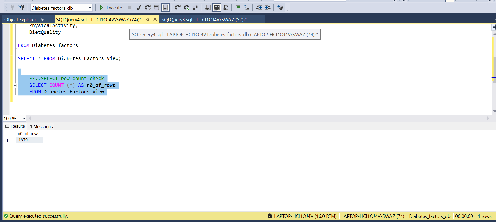


  ## Column count
  ```sql
/*
# Count the total number of columns (or fields) are in the SQL view
*/


SELECT
    COUNT(*) AS column_count
FROM
    INFORMATION_SCHEMA.COLUMNS
WHERE_
    TABLE_NAME = 'Diabetes_factors_2024_view'
```
### Output 

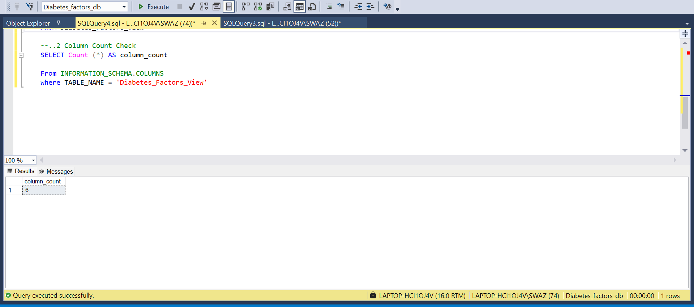


## Data Type Check
```sql
/*
# Check the data types of each column from the view by checking the INFORMATION_SCHEMA view
*/

-- 1.
SELECT
    COLUMN_NAME,
    DATA_TYPE
FROM
    INFORMATION_SCHEMA.COLUMNS
WHERE
    TABLE_NAME = 'Diabetes_factors_2024_view';
```

  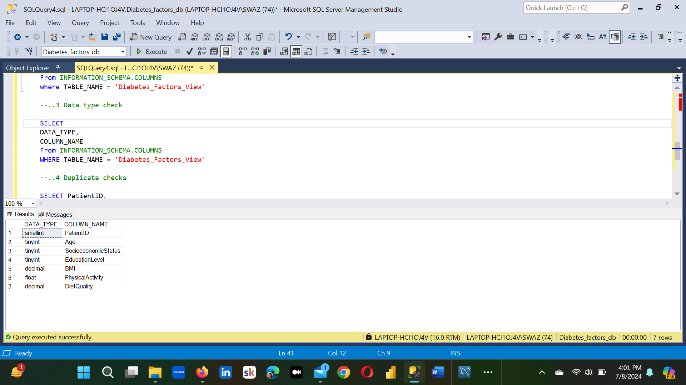


## Duplicate count check
### SQL query 
```sql
/*
# 1. Check for duplicate rows in the view
# 2. Group by the PatientId
# 3. Filter for groups with more than one row
*/

-- 1.
SELECT
    PatientId
FROM
    Diabetes_factors_View

-- 2.
GROUP BY
   PatientId

-- 3.
HAVING
    COUNT(*) > 1;
```
### Output

  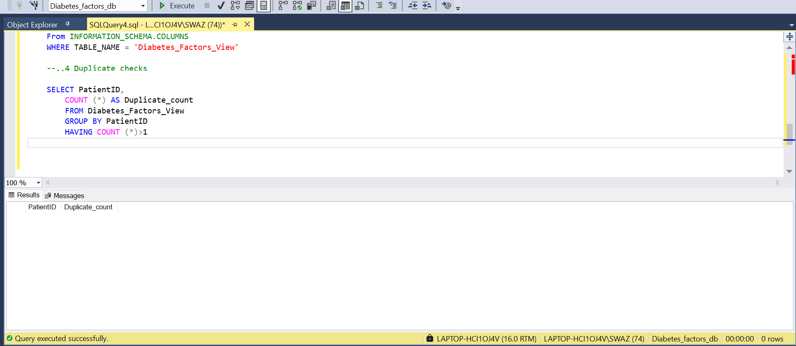


# Visualization  
   


   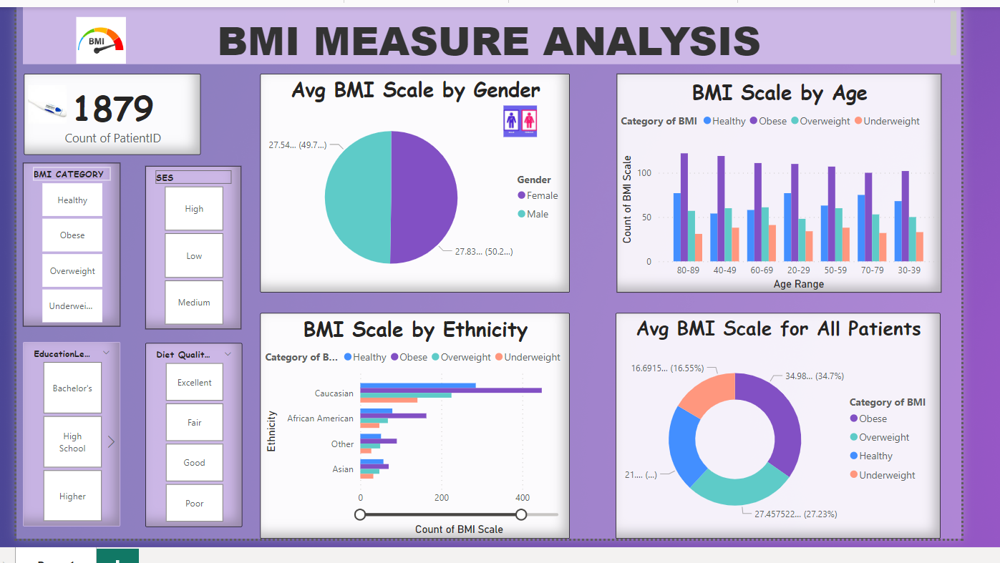
  
This shows the different factors that affect BMI measures and to what extent.


## DAX Measures

### 1. Average BMI Categories

```sql
SWITCH(
    TRUE(),
    Diabetes_factors_2024_view[BMI] < 18.5, "Underweight",
    Diabetes_factors_2024_view[BMI] >= 18.5 && Diabetes_factors_2024_view[BMI] < 24.9, "Normal weight",
    Diabetes_factors_2024_view[BMI] >= 25 && Diabetes_factors_2024_view[BMI] < 29.9, "Overweight",
    Diabetes_factors_2024_view[BMI] >= 30, "Obese",
    "Unknown"
)
```
### Output

 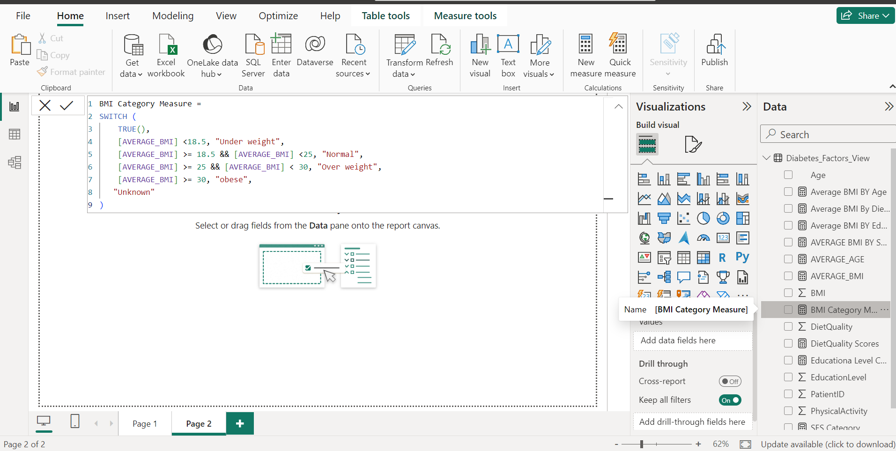

Return Average BMI of All Patients


Reference for the above DAX calulation is based on World Health Organization measuring Chart.


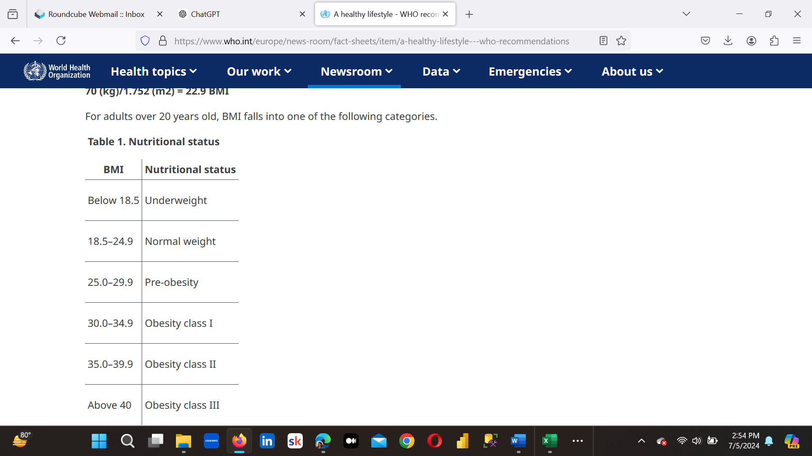


### SOCIAL ECONOMIC STATUS

  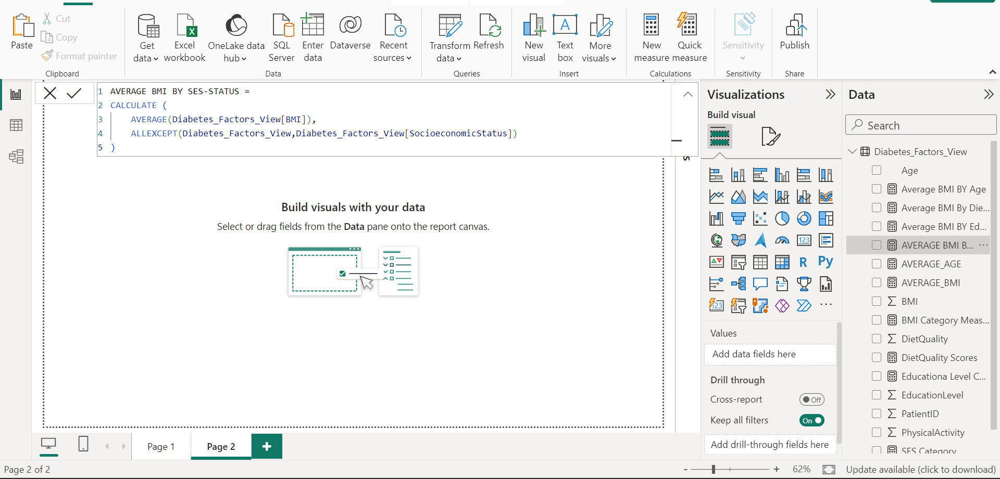

Return Socila Economic status againts average BMI


### EDUCATIONAL LEVEL

  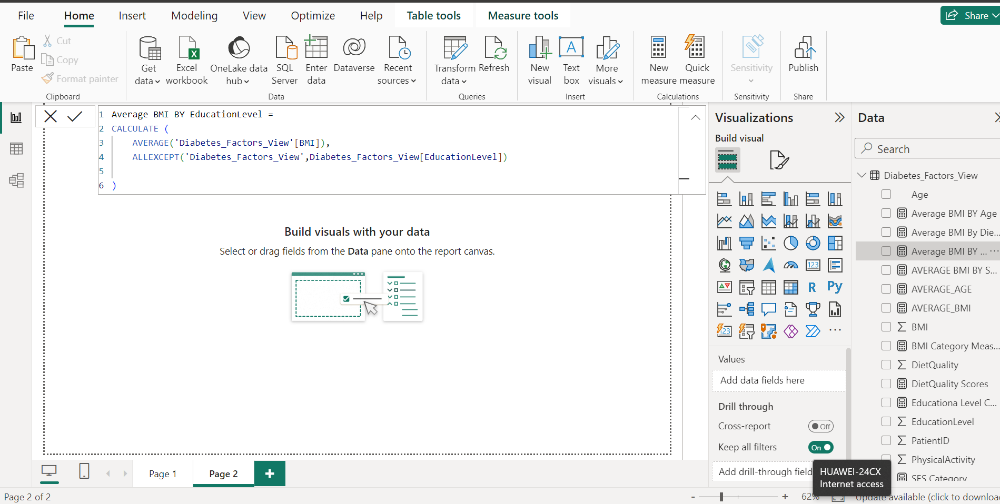


return Educational Level Against Average BMI


### DIET SCORES

  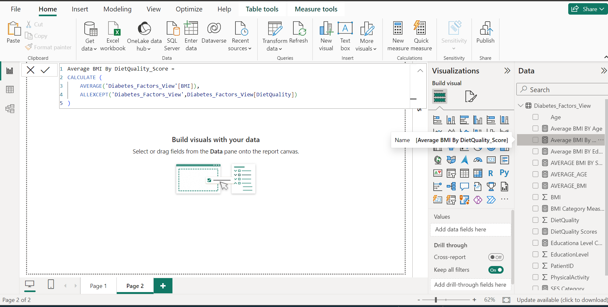

 return Average Diet Score Against Average BMI  


# Data Analysis

   
  (i) Analyzing the distribution of age and average BMI reveals insights into health demographics concerning BMI categories.

  (ii) Examining BMI and socioeconomic factors involves analyzing the distribution of BMI based on various socioeconomic factors to identify correlations and impacts on             BMI outcomes.

  (iii) Investigating BMI in relation to educational attainment assesses the impact of education on BMI and overall health.

   (iv) Exploring BMI categories in connection with diet quality and habits helps understand the dietary influences on BM
    
   (v) BMI against diet scores was analyzed to determine the impact of diet on average BMI measurements.
     

  # Findings
  

   (i) BMI Age Analysis: Highlighted obesity trends across different age groups, emphasizing the need for age-specific health interventions. While all age groups recorded               over 100 obese patients, the age groups 40-49 and 80-89 had the highest numbers. 
    
  (ii) BMI Education Analysis: Identified higher obesity rates among individuals with Bachelor's degrees. This group constitutes at least 39% of the population and has a             significant number of individuals with average BMI above the recommended levels.
    
  (iii) BMI Socioeconomic Status Analysis: Noted variations in BMI across different socioeconomic groups, with medium-income earners having the highest number of obese                 patients, recording 302.
  
   (iv) BMI Diet Score Analysis: Individuals with poor and fair diet scores had above-average BMIs. Out of a population of 1,879, 321 had poor diet scores, and 245 had               fair diet scores. These groups, categorized as obese, constituted 30% of the population.

   (V) BMI Ethnicity Analysis: It was noted that individuals of Caucasian descent had above-average BMIs. Out of the population, 280 Caucasians were recorded as obese and               overweight.

   (Vi) BMI Gender Analysis: Gender has a minimal impact on average BMI measurements, with only a 1% difference between men and women. Women have a slightly higher average             BMI than men.

  (Vii) It was also noted that 34% of the entire population was categorized as obese, and 27% was found to be overweight. This means over half of the population is                     classified as unhealthy and at potential risk for serious diseases.
  
     
# Recommendations

   (i) BMI by Age: Develop targeted interventions for specific age groups to prevent obesity. Focus on early intervention for the 20-29 age group to help them adopt and           maintain a healthy lifestyle. For other age groups, implement tailored programs addressing their unique needs and challenges to promote overall health and prevent               obesity.
    
  (ii)  BMI by Socioeconomic Status: Implement customized health programs tailored to different socioeconomic status (SES)groups. For lower SES groups, offer subsidized or             free access to nutrition education, healthy food options,and physical activity programs. For higher SES groups, focus on maintaining healthy habits through               advanced wellness programs, regular health screenings, and lifestyle coaching. This approach ensures that healt interventions are accessible and effective across           varying economic conditions.
    
  (iii) BMI by Education Level: Tailor public health campaigns to promote healthy lifestyles for different educational backgrounds. For lower education levels, offer                   simple health tips and community programs. For higher education levels, provide detailed health information and specialized wellness activities.
    
   (iV) BMI by Diet Score: Promote healthier eating habits through targeted nutritional guidance and education. Offer workshops and resources to improve diet quality for               those with poor and fair diet scores, and provide  personalized meal planning and cooking classes to support better dietary choices.

# Conclusion

The BMI analysis project has provided valuable insights into the factors influencing obesity across different demographics. The findings underscore the importance of age, education, socioeconomic status, and diet in shaping BMI trends. By implementing targeted interventions and tailored health programs, we can address the specific needs of various groups and promote healthier lifestyles.

# Project Evaluation

This project was a worthwhile undertaking as it highlighted critical areas for intervention and provided actionable recommendations to combat obesity. The insights gained from this analysis can inform public health policies and programs, ultimately contributing to better health outcomes for diverse populations. The project's success lies in its ability to identify at-risk groups and propose practical solutions, making it a valuable contribution to public health research and practice.


