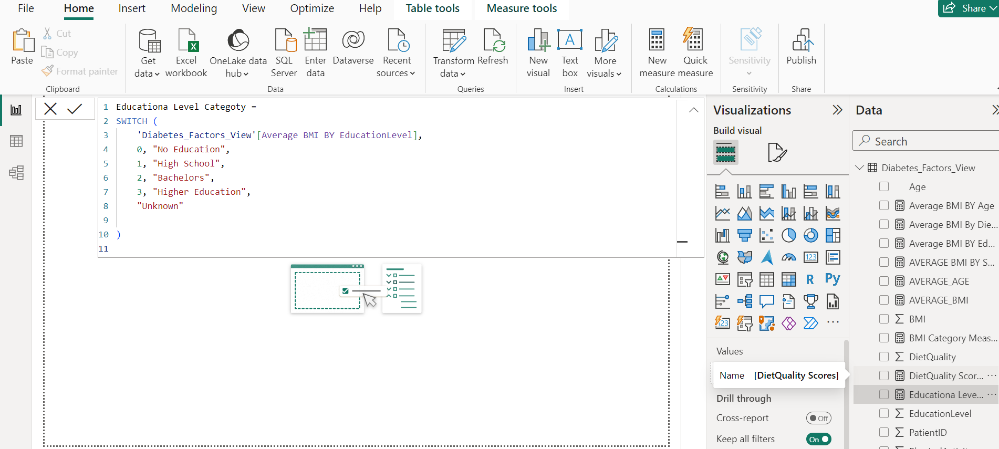
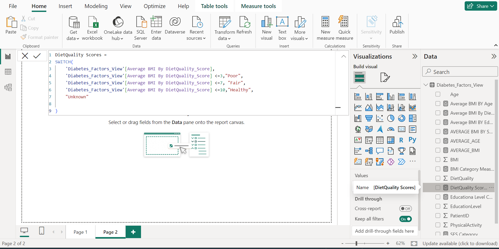

# PORFOLIO- SQL TO POWER BI

# Diabetes_factors_2024

## Exploring BMI Categories and Health Factors: A Data Analysis Project

# Table of contents 

- [Objective](#objective)
- [User story](#Userstory)
- [Data Source](#data-source)
- [Stages](#stages)
- [Design](#design)
  - [Tools](#tools)
- [Development](#development)
  - [Pseudocode](#pseudocode)
  - [Data Exploration](#data-exploration)
  - [Data Cleaning](#data-cleaning)
   - [Testing](#testing)
  - [Data Quality Tests](#data-quality-tests)
- [Visualization](#visualization)
  - [Results](#results)
  - [DAX Measures](#dax-measures)
- [Analysis](#analysis)
  - [Findings](#findings)
   - [Discovery](#discovery)
- [Recommendations](#recommendations)
  - [Conclusion](#conclusion)

# Objective

Objective of Project
Exploring the correlation between BMI and variables like age, socioeconomic status, diet, and education to identify populations at risk of hypertension and diabetes.
Key Pain Point

Understanding how BMI correlates with various factors to pinpoint vulnerable populations and inform targeted health interventions.

## User Story
I aimed to design a dashboard providing instant analytics on BMI, age, socioeconomic status, education, and diet to identify and support populations at risk of hypertension and diabetes.

The Dashboarrd will provide insights about the potential triggers of diebetes with people of a high BMI measure
  - BMI and Age
  - BMI and Socio-Economic Factors
  - BMI Against Education
  - BMI Against Diet
  - BMI Against Gender
  - BMI Against Ethnicity

# Data Source

This dataset contains comprehensive health data for 1,879 patients, including critical information such as Patient ID, Demographic Details, and Lifestyle Factors,it offers insights into factors impacting the prevalence of diabetes.[The data is sourced from Kaggle: ](https://www.kaggle.com/datasets/rabieelkharoua/diabetes-health-dataset-analysis)

# Stages

- Design
- Developement
- Testing
- Analysis 

# Design 

## Dashboard components required 
- What should the dashboard contain based on the requirements provided?

The dashbord should answer the following question

1. Which age group has the highest BMI Measure?
2. Does Ethicinity have a factor on BMI Measure?
3. Which educational level has the worst BMI?
4. What is the Average BMI across the Population in Question?
5. Is Gender a factor interms of Average BMI?
6. To what Extent is Diet a Factor to Average BMI?

## Tools Used

    Excel: Data exploration
    SQL Server: Data cleaning, testing, and analysis
    Power BI: Data visualization through interactive dashboards
    GitHub: Hosting project documentation

# Development

## Pseudocode

- General Approach

1. Get the data
2. Explore the data in Excel
3. Load the data into SQL Server
4. Clean the data with SQL
5. Test the data with SQL
6. Visualize the data in Power BI
7. Generate the findings based on the insights
9. Publish the data to GitHub Pages

   

## Data Exploration

This is the stage where you have a scan of what's in the data, errors, inconcsistencies, bugs, weird and corrupted characters etc  

- Initial Observations:
  1. The dataset is voluminous; focused on relevant data matching project objectives.
  2. Identified inconsistencies in decimal places, standardized across relevant columns.
  3. Categorised all data that was represented by Binary coding .

## Data Cleaning

  -  Column and Row Checks:
  1. Ensured data integrity through column count,
  2. row count
  3. duplication checks.
  4. Verified data types for accuracy.
  5.  Cheched for Null and Blanks  

    Working Dataset:
       Reduced columns from 46 to 10, focusing on key variables.
       Standardized BMI, diet quality, and activity to 4 decimal places for consistency.

## Data Testing

Below are the Data Quality Check

## Row count

  

## Data Type Check

  

## Duplicate Check

  

   # Visualization  
   
-  POWER BI DASHBOARD
-  
   
  
This shows the different factors that affect BMI measures and to what extent.

## DAX Measures

### AVERAGE BMI CATEGORIS

  

RETURN  Average BMI across all patients

### SOCIAL ECONOMIC STATUS
  

RETURN  Scotial economic status againts average BMI

### EDUCATIONAL LEVEL

  

RETURN Educational Level Against Average BMI

### DIET SCORES

  

 return Diet Score Against Average BMI  

# Data Analysis

    1.  BMI and Age:
        Analyzed BMI distribution across age groups to understand health demographics related to BMI categories.

    2.  BMI and Socio-Economic Factors:
        Examined BMI distribution based on socioeconomic factors, identifying correlations and impacts on BMI outcomes.

    3.  BMI Against Education:
        Investigated BMI in relation to educational attainment to assess educational impacts on BMI and health.

    4.  BMI Against Diet:
        Explored BMI categories in connection with diet quality and habits to understand dietary influences on BMI.

  ## Findings

    BMI – Age Analysis: Highlighted obesity trends across different age groups, emphasizing the need for age-specific health interventions.
    BMI – Education Analysis: Identified higher obesity rates among certain education levels, suggesting lifestyle impacts.
    BMI – Socioeconomic Status Analysis: Noted variations in BMI across different socioeconomic groups, proposing tailored health programs.

# Recommendations

    BMI by Age: Develop targeted interventions for specific age groups to prevent obesity.
    BMI by Socioeconomic Status: Implement customized health programs for different SES groups.
    BMI by Education Level: Tailor public health campaigns to promote healthy lifestyles among different educational backgrounds.
    BMI by Diet Score: Encourage healthier eating habits through nutritional guidance and education.

# Conclusion

This project underscores the importance of targeted health interventions based on age, socioeconomic status, education, and diet quality to promote healthier BMI outcomes and combat obesity.

